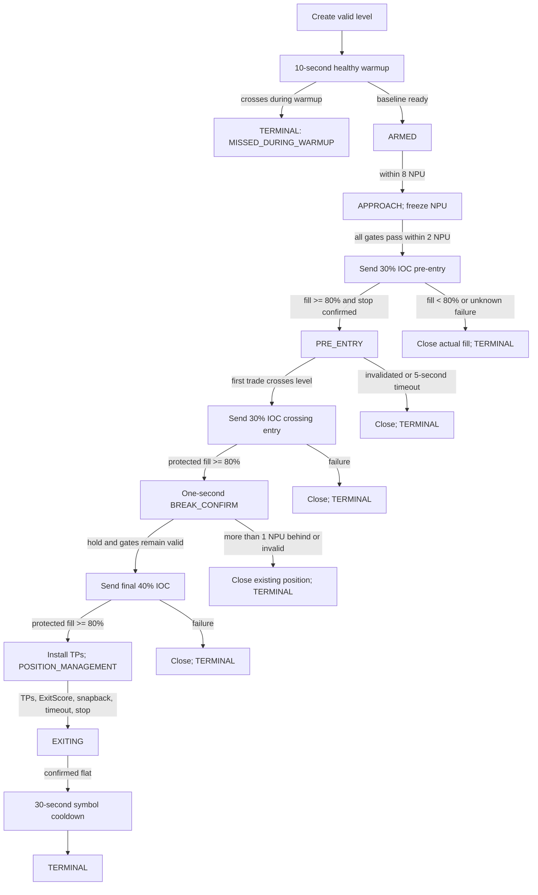

# Product Requirements Document: Binance Futures Level-Breakout Bot

**Document status:** Approved implementation baseline  
**Version:** 1.0  
**Date:** 2026-07-29  
**Product type:** Single-user, self-hosted, live trading bot  
**Target exchange:** Binance USDⓈ-M Futures  
**Primary strategy source:** `strategiya_proboya_binance_futures.docx`  
**Reference backend:** `C:\IdeaProjects\liner-bff`  
**Reference market-data starter:** `C:\IdeaProjects\liner-starter`  
**Reference DTO project:** `C:\Users\Иван\IdeaProjects\liner-dto`

> This document is the implementation source of truth. Decisions recorded here override conflicting suggestions in the original strategy document.

## 1. Product summary

The product is a production-capable Binance USDⓈ-M Futures trading bot for a single operator and a dedicated Binance account.

The operator manually creates breakout levels. For each level, the bot:

1. subscribes to live market data;
2. builds a short adaptive market baseline;
3. detects a qualified approach to the level;
4. opens the planned position in three stages;
5. installs an exchange-side emergency stop after the first actual fill;
6. confirms or invalidates the breakout using trade-flow and price-response rules;
7. installs three exchange-side take-profit orders after confirmation;
8. exits early if the breakout thesis is invalidated;
9. enforces per-level and daily risk limits;
10. records every decision and relevant market event.

The product is not a level-discovery system. The operator is responsible for selecting levels and expected movement potential.

## 2. Product goals

### 2.1 Primary goals

- Execute manually selected breakout trades consistently and without emotional intervention.
- Detect sustained directional pressure rather than treating one large trade as a valid breakout.
- Enter partly before the breakout, add at the crossing, and complete the position only after confirmation.
- Protect every filled position with an exchange-side hard stop.
- Exit before the hard stop when price action or order flow invalidates the setup.
- Keep the maximum planned loss of each level within 1% of its configured position notional.
- Stop the trading day at a 5% total-equity drawdown.
- Survive WebSocket failures, uncertain order responses, partial fills, and stale data without blind order retries.
- Provide a simple, secured web interface for one operator.
- Produce sufficient audit and market-event data to reconstruct every trading decision.

### 2.2 Success definition

The first release is successful when:

- all state transitions are deterministic from the recorded inputs;
- no additional entry is sent after data becomes unhealthy;
- every actual entry fill receives a confirmed exchange-side hard stop before any later tranche;
- uncertain order outcomes never cause blind duplicate orders;
- all closing orders are reduce-only or close-position operations;
- the configured per-level and daily risk rules are enforced;
- daily and manual kill paths close account exposure as specified;
- the application builds and runs as one Docker image;
- the UI is reachable over HTTPS and protected by HTTP Basic authentication;
- the original `liner-starter` and `liner-dto` projects remain unchanged.

### 2.3 Non-goals

- Discovering, scoring, or suggesting trading levels.
- Multi-user support.
- Multiple Binance accounts.
- Spot, Coin-M Futures, options, or exchanges other than Binance USDⓈ-M Futures.
- Hedge Mode.
- Multi-Assets Mode.
- Persistent recovery of levels or state-machine state after restart.
- Startup discovery or adoption of existing positions and orders.
- Editing an existing level.
- Automatically expiring or deleting old levels.
- Automatically retrying a consumed level.
- Automatically moving the hard stop after a take profit.
- A searchable symbol selector.
- A browser WebSocket or SSE feed.
- A database, MongoDB, RabbitMQ, or other message broker.
- Binance testnet support.
- A runtime shadow-trading mode.
- Guaranteed profitability.

## 3. Source-of-truth and strategy overrides

The original strategy document contains hypotheses and alternative options. The following final product decisions override them.

| Topic | Final requirement |
|---|---|
| Environment | Live Binance only; no testnet selector |
| Level lifetime | No `valid_from` or `valid_until`; a level remains until manually deleted |
| Attempts | Exactly one attempt per level |
| Level mutation | Create and delete only; no update |
| State persistence | Levels and runtime state are memory-only |
| Startup recovery | Do not query positions or open orders on startup |
| Pre-entry reconciliation | Do not perform a general position/open-order check before entry |
| Take-profit reference | Calculate all targets from the configured level price, not average entry price |
| Hard stop after TP1 | Never move it |
| Position sizing input | Operator supplies target position notional in USDT |
| Level risk budget | 1% of configured level position notional |
| Daily loss budget | 5% of account equity anchored at 03:00 UTC |
| Entry allocation | 30% before crossing, 30% at crossing, 40% after confirmation |
| Entry orders | Bot-triggered marketable IOC limit orders |
| Application shutdown | Take no Binance action; terminate the process |
| Account ownership | Dedicated Binance account under exclusive bot control |

## 4. User and operating assumptions

### 4.1 User

There is one operator. The operator:

- selects every level;
- supplies the intended direction, level price, position notional, and expected maximum impulse;
- controls the Binance account;
- deploys and operates the DigitalOcean Droplet;
- manages API credentials, TLS certificates, firewall rules, and IP allowlists;
- manually deletes terminal or no-longer-needed levels;
- guarantees that no external system or person trades the dedicated account.

### 4.2 Explicit operator guarantees

The product intentionally does not check positions or open orders on startup and does not perform a general exposure check before an ordinary entry. Therefore the operator guarantees that:

- the Binance account is dedicated to this bot;
- no unmanaged position or order exists when the bot is started;
- no second bot instance controls the account;
- the container is not started twice;
- the operator has manually resolved any exchange-side orders or exposure left by an earlier process before starting a new process.

Violation of these assumptions can cause a One-way Mode order to merge with existing exposure, invalidate the 1% level-risk calculation, or leave an old exchange order unmanaged.

## 5. Exchange account requirements

### 5.1 Required account configuration

- Product: Binance USDⓈ-M Futures.
- Position mode: One-way Mode.
- Asset mode: Single-Asset Mode using USDT.
- Margin type: Isolated Margin for every traded symbol.
- Auto-Add Margin: disabled for every traded symbol.
- Leverage: selected by the risk engine as described below.
- Account use: exclusive to this bot.

Hedge Mode and Multi-Assets Mode are rejected. The bot must not automatically change the account-wide position mode or asset mode.

### 5.2 Per-symbol setup

When a level is created, the bot may perform the following symbol-scoped actions:

1. load and validate Binance symbol filters and leverage brackets;
2. select leverage as `min(20, maximum leverage allowed for the symbol and planned notional)`;
3. set and verify Isolated Margin;
4. disable and verify Auto-Add Margin;
5. set and verify the selected leverage;
6. verify that the estimated liquidation price is beyond the planned hard stop on the loss side.

If any required account property cannot be established or verified, the level is rejected or remains non-tradable with a visible reason.

### 5.3 API credentials

The bot-local authenticated Binance client uses:

- an API key identifier;
- an HMAC secret;
- signed REST requests;
- the authenticated user-data stream.

Credentials come only from environment variables. A hard-coded key present in a reference project must not be used for trading.

The Binance API key must:

- permit Futures trading;
- have withdrawals disabled;
- be restricted to the Droplet's public IP.

## 6. Level model and lifecycle

### 6.1 Operator-supplied fields

Each level contains:

| Field | Type | Meaning |
|---|---|---|
| `symbol` | String | Binance USDⓈ-M Futures symbol, for example `BTCUSDT` |
| `direction` | Enum | `LONG` or `SHORT` |
| `levelPrice` | Decimal | Breakout level price |
| `positionNotionalUsdt` | Decimal | Intended full position notional, independent of leverage |
| `maxImpulsePct` | Decimal | Operator's expected maximum move from the level |

The backend uppercases the symbol and validates all values against live Binance symbol metadata.

### 6.2 Derived level values

The bot derives:

- normalized level price using the symbol tick size;
- planned full quantity using the configured notional and a sizing reference price;
- 30% / 30% / 40% tranche quantities, rounded to step size;
- three take-profit prices;
- expected fees and slippage;
- leverage and projected isolated margin;
- structural hard stop;
- planned net reward-to-risk ratio;
- current level state, blockers, gates, and terminal reason.

All prices and quantities must satisfy the Binance tick-size, step-size, minimum-quantity, and minimum-notional filters.

### 6.3 Creation rules

A level is created only when:

- the symbol exists and is a tradable USDⓈ-M perpetual contract;
- all numeric inputs are positive and finite;
- the current price is strictly on the pre-break side:
  - `LONG`: current price is below the level;
  - `SHORT`: current price is above the level;
- the normalized level is not an exact duplicate;
- fewer than 100 levels are stored;
- symbol configuration can be set and verified;
- the expected liquidation price lies beyond the hard stop;
- the target quantity is executable under exchange filters.

If current price equals or has already crossed the level, the level is not created and the API returns `LEVEL_ALREADY_CROSSED`.

### 6.4 Duplicate rule

An exact duplicate is the same:

`(normalized symbol, direction, tick-rounded level price)`

Exact duplicates are rejected. The bot does not attempt fuzzy or near-level duplicate detection; the operator is responsible for avoiding logically overlapping levels.

### 6.5 Capacity

- Maximum stored levels: 100.
- Maximum concurrently open-position symbols: 5.
- Maximum active attempt or position per symbol: 1.
- Multiple stored levels may exist for one symbol.
- When one symbol has an active attempt or position, its other levels remain visible but cannot enter.
- Market streams are shared per symbol rather than opened once per level.

### 6.6 Deletion

- The operator may delete a level with no exposure.
- Deletion is rejected while the level owns a position or unresolved order.
- To remove a level with exposure, the operator must first use the explicit close-position action and wait until the position is confirmed flat.
- Terminal levels are not automatically removed.
- There is no update operation.

### 6.7 One-attempt consumption

A level has exactly one trading attempt.

The attempt becomes consumed when the first entry order is dispatched. A level is not consumed merely because market gates are false.

After a rejected fill, invalidation, abort, exit, hard stop, or completed take-profit sequence, the level remains terminal until the operator deletes and recreates it.

## 7. Market data requirements

### 7.1 Required public streams

Per active symbol, the bot consumes:

- aggregate trades;
- best bid and ask updates.

Each aggregate trade event must include:

- symbol;
- aggregate trade ID `a`;
- event time `E`;
- trade time `T`;
- price `p`;
- quantity `q`;
- buyer-is-maker flag `m`;
- derived aggressive side;
- local receive timestamp.

Best-bid/ask data must include:

- bid price and quantity;
- ask price and quantity;
- exchange event or update time when provided;
- local receive timestamp.

### 7.2 Aggressor mapping

The `buyerIsMaker` flag is mapped consistently:

- `buyerIsMaker = false`: aggressive buy;
- `buyerIsMaker = true`: aggressive sell.

Parser fixture tests must prove this mapping using real Binance message samples.

### 7.3 Data integrity

- Deduplicate aggregate trade IDs.
- Detect an unresolved gap in aggregate trade IDs.
- Preserve both exchange and local times.
- Calculate market-event age from local receive/decision time and synchronized exchange time.
- Quantize prices and quantities only at exchange/order boundaries; preserve precise decimals in metrics.
- Never interpret the absence of trades by itself as a market-data outage.

### 7.4 Entry data-health gates

New entries and additions are blocked when any of the following is true:

- newest required market event is older than 250 ms;
- public WebSocket is disconnected;
- aggregate trade IDs have an unresolved gap;
- best-bid/ask data is missing or stale;
- spread is greater than one NPU;
- spread is greater than 0.10% of price;
- a private order outcome is unresolved;
- the private user-data stream is unhealthy.

Both spread limits apply; the stricter effective limit wins.

## 8. Time windows and normalized price unit

### 8.1 Metric windows

| Window | Duration | Purpose |
|---|---:|---|
| FAST | 250 ms | Immediate impulse and order timing |
| MID | 1 second | Local trend, response, and confirmation |
| SLOW | 5 seconds | Per-symbol activity baseline |

Counts and volume are normalized to rates per second before windows are compared.

### 8.2 NPU definition

NPU means **normalized price unit**. It converts a symbol's recent micro-volatility into an exchange-valid price distance.

The exact calculation is:

1. sample mid-price every 100 ms;
2. retain a rolling 10-second sample history;
3. calculate absolute consecutive mid-price moves;
4. set `rawNpu = max(tickSize, percentile75(absoluteMoves))`;
5. round `rawNpu` upward to a whole tick;
6. recompute once per second while the level is `ARMED`;
7. freeze the NPU when the level enters `APPROACH`;
8. retain the frozen value until the attempt ends.

NPU is displayed in both absolute-price and percentage form.

### 8.3 NPU-dependent constants

| Rule | Value |
|---|---:|
| Activation band | 8 NPU from the level |
| Pre-entry eligibility distance | 2 NPU before the level |
| Confirmation noise allowance | 1 NPU behind the level |
| Price-response minimum | 0.5 NPU in MID |
| Maximum MID adverse pullback | 2 NPU |
| Hard snapback | More than 2 NPU behind level within 500 ms |
| Structural-stop base offset | 3 NPU from level |
| Structural swing buffer | 1 NPU |
| IOC entry price cap | 1 NPU through current best price |
| IOC soft-exit price cap | 1 NPU through current best price |

## 9. Metrics

For any window `w`:

```text
TPS(w)            = count(trades in w) / durationSeconds(w)
VolumeRate(w)     = sum(quantity in w) / durationSeconds(w)
AvgTradeSize(w)   = sum(quantity in w) / count(trades in w)
BuyShare(w)       = buyQuantity / (buyQuantity + sellQuantity)
SellShare(w)      = sellQuantity / (buyQuantity + sellQuantity)
DeltaRate(w)      = (buyQuantity - sellQuantity) / durationSeconds(w)
AvgBuySize(w)     = buyQuantity / buyTradeCount
AvgSellSize(w)    = sellQuantity / sellTradeCount
AccelTPS          = TPS(FAST) / max(TPS(SLOW), epsilon)
AccelVolume       = VolumeRate(FAST) / max(VolumeRate(SLOW), epsilon)
SizeRatio         = AvgTradeSize(FAST) / max(AvgTradeSize(SLOW), epsilon)
```

Directional price metrics are sign-normalized:

- positive means progress toward or through the breakout;
- negative means movement against the setup.

```text
PriceProgress(w)  = signed(lastPrice - firstPrice)
Pullback(w)       = maximum adverse excursion within w
FlowEfficiency(w) = PriceProgress(w) / max(aggressiveVolume(w), epsilon)
```

The sign is normal for `LONG` and mirrored for `SHORT`.

## 10. Signal gates

### 10.1 V1 decision policy

In version 1, transparent mandatory gates control trading. `PressureScore` is calculated and logged for analysis but does not directly authorize an entry.

### 10.2 Acceleration gate

The acceleration gate passes only when:

```text
AccelTPS >= 1.5
AND AccelVolume >= 1.5
AND (AccelTPS >= 2.0 OR AccelVolume >= 2.0)
```

### 10.3 Directional-flow gate

For `LONG`:

```text
BuyShare(FAST) >= 0.62
DeltaRate(FAST) > 0
DeltaRate(MID) > 0
```

For `SHORT`:

```text
SellShare(FAST) >= 0.62
DeltaRate(FAST) < 0
DeltaRate(MID) < 0
```

### 10.4 Ramp gate

The latest two seconds are split into eight 250 ms bins.

For each bin, activity equally combines normalized:

- trades per second;
- aggressive quote-volume rate.

The ramp gate passes only when:

- at least 5 of the 7 adjacent activity changes are non-negative;
- average activity of the final two bins is at least 1.5 times the average of the first two bins;
- latest-bin activity is at least 70% of the strongest bin.

### 10.5 One-shot burst rejection

A suspicious one-shot burst exists only when all of these are true:

- the largest FAST trade represents at least 60% of FAST volume;
- activity in the following 250 ms is less than 50% of the burst bin;
- post-burst signed price progress is less than 0.5 NPU.

An unresolved or active one-shot burst blocks pre-entry and additions.

### 10.6 Price-response gate

The price-response gate passes only when:

- signed MID progress is at least 0.5 NPU;
- maximum adverse MID pullback is no more than 2 NPU.

Raw `FlowEfficiency` is logged for research.

### 10.7 PressureScore diagnostic

For `LONG`:

```text
PressureScore =
    0.20 * score(AccelTPS)
  + 0.20 * score(AccelVolume)
  + 0.15 * score(SizeRatio)
  + 0.20 * score(BuyShare)
  + 0.15 * score(RampScore)
  + 0.10 * score(FlowEfficiency)
```

For `SHORT`, directional components are mirrored, including use of `SellShare`.

The score and every component are logged. Score normalization is an analytical concern and must not silently replace the mandatory gates in v1.

## 11. Trading state machine

### 11.1 Level states

| State | Meaning |
|---|---|
| `WARMING_UP` | Building the required healthy baseline after level creation |
| `ARMED` | Level is valid and waiting outside the activation band |
| `APPROACH` | Price entered the 8-NPU activation band and NPU is frozen |
| `PRE_ENTRY_PENDING` | First 30% entry intent dispatched; order outcome being resolved |
| `PRE_ENTRY` | Some or all of the first 30% filled and hard stop is confirmed |
| `CROSS_ENTRY_PENDING` | Second 30% entry intent dispatched |
| `BREAK_CONFIRM` | Crossing occurred and one-second confirmation is running |
| `CONFIRM_ENTRY_PENDING` | Final 40% entry intent dispatched |
| `POSITION_MANAGEMENT` | Breakout confirmed; take profits and exit logic active |
| `EXITING` | A close is in progress and residual quantity is being reconciled |
| `COOLDOWN` | Per-symbol post-exit cooldown |
| `TERMINAL` | Attempt completed or failed; delete/recreate required |

Global states can block otherwise eligible levels:

- `RUNNING`;
- `ENTRY_COOLDOWN`;
- `SAFE_MODE`;
- `DAILY_LOCKED`;
- `MANUAL_LOCK`.

### 11.2 Lifecycle



### 11.3 Warmup

- A level requires 10 continuous seconds of healthy history before it can leave `WARMING_UP`.
- If price reaches or crosses the level during warmup, the level becomes terminal with `MISSED_DURING_WARMUP`.
- The bot must not enter late after warmup.

### 11.4 Crossing definition

Crossing is based on the first qualifying live aggregate trade:

- `LONG`: trade price is greater than or equal to the level;
- `SHORT`: trade price is less than or equal to the level.

Best bid/ask alone does not define a crossing.

## 12. Entry sequence

### 12.1 Allocation

The target full quantity is divided into:

- 30% pre-entry;
- 30% at first crossing;
- 40% after confirmation.

Rounding residue is assigned so the total never exceeds the valid target quantity.

### 12.2 Pre-entry

The first 30% may be dispatched only when:

- price is on the pre-break side and no farther than 2 frozen NPU from the level;
- the 10-second healthy warmup is complete;
- all acceleration, directional-flow, ramp, burst, price-response, spread, latency, and data-integrity gates pass;
- no global or per-symbol lock blocks entry;
- global risk is atomically reserved;
- planned stop, margin, liquidation, and net-R checks pass.

### 12.3 Entry order type

All three tranches use marketable IOC limit orders.

For `LONG`:

```text
limitPrice = bestAsk + 1 NPU
```

For `SHORT`:

```text
limitPrice = bestBid - 1 NPU
```

The price is rounded using the symbol's tick size. The bot does not chase beyond this cap.

### 12.4 Minimum fill

Each tranche must fill at least 80% of its requested quantity.

If a tranche fills less than 80%:

1. do not blindly retry the remainder;
2. reconcile the actual fill;
3. close all actual position quantity;
4. mark the level `INSUFFICIENT_LIQUIDITY`;
5. consume the attempt.

### 12.5 Exchange-side protection sequencing

After the first actual fill:

1. reconcile actual filled quantity;
2. place a close-all `STOP_MARKET` hard stop;
3. confirm the stop exists and has the expected trigger;
4. only then permit any later tranche.

Maximum allowed time to confirm the stop is 2 seconds.

If the stop cannot be confirmed:

1. reconcile actual exposure;
2. close it;
3. enter `SAFE_MODE`;
4. mark the attempt terminal.

If the level crosses before the first fill has been reconciled and protected:

1. do not send a late crossing tranche;
2. reconcile any fill;
3. close actual exposure;
4. mark `CROSS_BEFORE_PROTECTED`.

### 12.6 Crossing tranche

The second 30% is triggered by the bot on the first crossing aggregate trade. There is no resting exchange order at the level.

It is sent only if:

- first-tranche fill is resolved;
- hard stop is confirmed;
- market and private data remain healthy;
- the attempt has not been invalidated.

### 12.7 Confirmation

After crossing, the bot runs a one-second confirmation window.

Normal noise is acceptable while price stays within one NPU behind the level.

Confirmation passes only when:

- price holds no deeper than one NPU behind the level;
- mandatory directional pressure remains valid;
- there is no active one-shot burst;
- absorption/ExitScore does not invalidate the trade;
- public and private data remain healthy.

If price moves more than one NPU behind the level during confirmation:

- close the existing position;
- consume the attempt.

### 12.8 Final tranche

After successful confirmation, the final 40% IOC order is sent.

The same:

- data gates;
- protection requirement;
- 80% minimum-fill rule;
- no-blind-retry rule

apply to the final tranche.

## 13. Pre-break invalidation

After pre-entry and before a confirmed breakout, close actual exposure and consume the attempt if any condition occurs:

- price retreats adversely by more than 2 frozen NPU from the best post-entry price;
- directional share falls below 50% while delta remains opposite for 500 ms;
- both `AccelTPS` and `AccelVolume` remain below 1.0 for 500 ms;
- the one-shot burst condition becomes active;
- required market data is continuously unhealthy for 3 seconds;
- the level is not crossed within 5 seconds after the first pre-entry fill.

The bot may close earlier than the hard stop whenever the breakout thesis becomes invalid. The 1% level limit is an emergency maximum, not a requirement to wait for that loss.

## 14. Position management and exits

### 14.1 ExitScore

`ExitScore` is recomputed from current observations. Points are not permanently accumulated.

For `LONG`:

| Points | Condition |
|---:|---|
| +2 | Aggressive buy share is at least 62%, but MID signed progress is below 0.25 NPU |
| +1 | Opposite `AvgTradeSize(FAST)` is at least 2 times its SLOW baseline |
| +2 | Delta remains against the position continuously for 500 ms |
| +2 | Price is more than 1 NPU behind the level |
| +1 | Activity is at least 1.5 times baseline while progress is below 0.25 NPU |

For `SHORT`, sides and signs are mirrored.

Close the position when `ExitScore >= 3`.

### 14.2 Immediate snapback

Close immediately, regardless of total ExitScore, if price moves more than 2 NPU behind the level within 500 ms.

### 14.3 Maximum holding time

The maximum holding time for a confirmed position is 10 minutes.

- The timer starts when the breakout is confirmed.
- The original deadline is not reset at 03:00 UTC.
- At expiration, close any remaining position.

### 14.4 Normal soft exit

For strategy invalidation or the 10-minute timeout:

1. send one reduce-only marketable IOC limit close capped at 1 NPU through the best price;
2. wait up to 500 ms;
3. reconcile the residual;
4. close any remaining quantity with one reduce-only market order.

### 14.5 Emergency exit

The following use immediate reduce-only market closing rather than the normal IOC sequence:

- daily loss breach;
- manual kill switch;
- prolonged market-data failure with exposure;
- prolonged private-stream failure with exposure;
- unrecoverable order uncertainty when exposure is confirmed.

### 14.6 Post-exit cooldown

After any confirmed exit:

- the symbol enters a 30-second cooldown;
- no level for that symbol may start a new attempt during the cooldown.

## 15. Hard stop

### 15.1 Structural stop calculation

Immediately before the pre-entry intent:

For `LONG`:

```text
microSwingLow = minimum trade price during the preceding 1 second
structuralStop = min(levelPrice - 3*NPU, microSwingLow - 1*NPU)
```

For `SHORT`:

```text
microSwingHigh = maximum trade price during the preceding 1 second
structuralStop = max(levelPrice + 3*NPU, microSwingHigh + 1*NPU)
```

The stop is calculated using the frozen NPU and rounded to a valid trigger price.

### 15.2 Stop risk validation

Before the first order:

- estimate worst-case entry using the IOC price cap;
- include taker fees and the configured exit-slippage reserve;
- verify the full planned position cannot exceed its 1% level-risk budget under predictable conditions;
- verify planned net R is at least 1.5;
- verify estimated liquidation is beyond the stop.

If the structural stop is too far away, reject the attempt. Never tighten the stop merely to make the risk calculation pass.

### 15.3 Stop behavior

- Freeze the hard-stop trigger after the first actual fill.
- Do not widen, tighten, trail, or move it.
- Do not move it after TP1.
- Use an exchange-side close-all `STOP_MARKET`.
- Trigger source: `CONTRACT_PRICE`.
- Binance price protection: disabled.
- Maintain one active hard-stop intent per active symbol.

The user accepts that a market gap or severe slippage can cause actual loss to exceed the planned 1% limit.

## 16. Take profits

### 16.1 Target calculation

Take profits are calculated from `levelPrice`, not weighted entry.

Fixed impulse fractions:

- TP1: 35% of configured maximum impulse;
- TP2: 70%;
- TP3: 100%.

Fixed position allocations:

- TP1: 33%;
- TP2: 33%;
- TP3: 34%.

For `LONG`:

```text
TP(i) = levelPrice * (1 + maxImpulsePct * fraction(i) / 100)
```

For `SHORT`:

```text
TP(i) = levelPrice * (1 - maxImpulsePct * fraction(i) / 100)
```

Prices are rounded to valid tick prices using side-safe exchange rounding.

### 16.2 Placement

After the final confirmation tranche is resolved:

1. reconcile actual total position quantity;
2. calculate 33% / 33% / 34% executable quantities;
3. place all three reduce-only `LIMIT GTC` orders;
4. verify the complete take-profit set.

The setup must complete within 3 seconds.

If the full set cannot be verified:

1. cancel any TP fragments;
2. close actual exposure;
3. mark `TP_SETUP_FAILED`;
4. enter `SAFE_MODE`.

### 16.3 Stop interaction

Take-profit fills reduce exposure. The exchange-side close-all hard stop remains at its original trigger and protects the remaining position automatically.

## 17. Fee, slippage, and planned-R model

### 17.1 Commission

Before a symbol can trade, query the actual account commission rate for that symbol.

For conservative planning, assume:

- taker fee for all entry tranches;
- taker fee for all take-profit quantities, even though TPs are limit orders.

### 17.2 Slippage reserves

Planning includes:

- 1 NPU entry slippage reserve;
- 1 NPU soft/hard exit slippage reserve.

Unbounded market-gap loss is excluded from predictable planned risk but included in actual PnL and drawdown after it occurs.

### 17.3 Minimum economic quality

```text
PlannedNetR = estimatedNetReward / estimatedWorstNetLoss
```

The attempt is rejected unless:

```text
PlannedNetR >= 1.5
```

Estimated reward uses the weighted TP allocations. Estimated loss includes price loss to the hard stop, commission, and configured slippage reserves.

## 18. Risk engine

### 18.1 Account equity

Daily risk uses total account equity, including:

- wallet balance;
- unrealized PnL;
- realized PnL;
- trading fees;
- funding.

### 18.2 Daily anchor

At 03:00 UTC:

```text
dailyAnchorEquity = currentTotalAccountEquity
dailyLossLimit = dailyAnchorEquity * 0.05
```

Transfers must not count as trading profit or loss:

```text
tradingDrawdown =
    dailyAnchorEquity
  - currentTotalAccountEquity
  + depositsSinceAnchor
  - withdrawalsSinceAnchor
```

### 18.3 Restart anchor

Because state is memory-only:

- startup equity becomes a temporary daily anchor;
- the temporary anchor remains until the next 03:00 UTC boundary;
- the next 03:00 boundary establishes the normal anchor;
- restarting the process effectively resets the intraday daily budget.

The UI and audit log must make the temporary restart anchor explicit.

### 18.4 Level risk

For each level:

```text
levelRiskBudget = positionNotionalUsdt * 0.01
```

Example:

```text
positionNotionalUsdt = 2,000 USDT
levelRiskBudget = 20 USDT
```

The configured notional is exposure, independent of leverage. Leverage changes margin usage, not the level-risk budget.

### 18.5 Risk reservation

- Creating a level does not reserve daily risk.
- Immediately before dispatching the first entry intent, reserve the level's risk atomically on the serialized global risk queue.
- Reject with `BLOCKED_DAILY_RISK` if capacity is unavailable.
- Do not automatically downsize the level.
- Include current drawdown, open-position risk, and already-reserved pending-entry risk.
- Release or shrink reservation only after confirmed reducing fills or confirmed flat state.

The admission rule is:

```text
tradingDrawdown
+ reservedRiskForOpenPositions
+ reservedRiskForPendingAttempts
+ newLevelRiskBudget
<= dailyLossLimit
```

### 18.6 Daily breach

When total-equity trading drawdown reaches or exceeds 5%:

1. atomically block new entries and additions;
2. cancel pending entry intents and entry orders;
3. cancel take-profit orders where needed for deterministic liquidation;
4. immediately close all account positions reduce-only at market;
5. retain protective hard stops until each symbol is confirmed flat;
6. enter `DAILY_LOCKED`.

The dedicated-account assumption means "close all" applies to every account position.

### 18.7 Daily automatic resume

At the next 03:00 UTC boundary:

- establish a new equity anchor;
- reset the daily loss counter;
- preserve remaining worst-case risk reservations for positions that crossed the boundary;
- preserve original position holding deadlines;
- automatically leave `DAILY_LOCKED` when the account is in a valid state.

No manual confirmation is required for daily resume.

### 18.8 Margin buffer

After the planned entry, projected isolated initial margin must use no more than 80% of available margin. At least 20% remains free.

Reject the attempt if this buffer cannot be maintained.

### 18.9 Concurrent-position cap

At most five symbols may have open exposure concurrently.

### 18.10 Consecutive-loss cooldown

- Track closed attempts by net PnL after fees and funding.
- After three consecutive net-losing attempts, block all new entries for 15 minutes.
- Resume automatically after 15 minutes.
- A net-profitable attempt resets the loss streak.
- This cooldown does not close existing positions.

## 19. Order management and reconciliation

### 19.1 Deterministic client order IDs

Every order intent has a unique, deterministic `clientOrderId` containing enough identity to distinguish:

- application start time;
- level;
- attempt;
- order role;
- tranche or target;
- monotonic intent sequence.

The exact format must stay within Binance limits and be safe for logs.

### 19.2 No blind retries

An HTTP timeout or lost response does not prove rejection. The bot must never resend an order merely because the request timed out.

For an uncertain order:

1. wait for the private user-data event;
2. query order status by `clientOrderId`;
3. inspect position and relevant open orders;
4. perform three bounded status checks across three seconds;
5. resolve to filled, partially filled, rejected, canceled, or still unknown.

If it remains unknown:

- block further entries/additions;
- enter `SAFE_MODE`;
- close only exposure confirmed by reconciliation;
- preserve the exchange hard stop until flat.

### 19.3 Private stream

The authenticated user-data stream is authoritative for normal runtime:

- order lifecycle;
- fills;
- account updates;
- position changes.

REST reconciliation is used for uncertain or degraded runtime states.

### 19.4 Partial fills

- Risk, stop, TP, and close quantities use confirmed actual fills.
- Reserved risk is not reduced merely because an order was requested to reduce.
- It is reduced only after a confirmed reducing fill.
- A closing order must never increase or reverse the position.

## 20. Data failure and SAFE_MODE

### 20.1 Public market-data degradation

When public data is unhealthy for more than 250 ms:

- block all new entries and additions immediately;
- keep exchange-side protection in place.

When public data remains continuously unhealthy for more than 3 seconds while exposure exists:

1. reconcile exposure;
2. issue one idempotent reduce-only market close;
3. retain hard stop until flat;
4. enter `SAFE_MODE`.

No-trade periods alone are not outages. Health uses connection state, aggregate-ID continuity, bid/ask heartbeat, and event age.

### 20.2 Private-stream degradation

On private user-data stream loss:

- block new entries and additions immediately;
- use signed REST to reconcile runtime orders and positions;
- attempt to restore the private stream.

If the stream is not restored within 5 seconds while exposure exists:

1. close reconciled exposure;
2. retain hard stops until flat;
3. enter `SAFE_MODE`.

### 20.3 Automatic SAFE_MODE recovery

Automatic recovery requires all of the following:

- public and private streams continuously healthy for 30 seconds;
- three matching signed REST reconciliations;
- no unexplained exposure;
- no orphaned bot order;
- One-way Mode, Single-Asset Mode, isolated margin, leverage, Auto-Add Margin, and clock checks pass.

### 20.4 SAFE_MODE escalation

If three SAFE_MODE events occur in any rolling 15-minute interval:

1. flatten all account exposure;
2. cancel bot orders as required;
3. enter `MANUAL_LOCK`.

An explicit operator unlock is required.

## 21. Manual controls

### 21.1 Per-position close

The UI provides a close action per active symbol. It:

- blocks additions for the symbol;
- uses the normal reduce-only close procedure;
- confirms flat state;
- leaves the level terminal.

### 21.2 Global kill switch

The global kill switch:

1. blocks new entries immediately;
2. cancels pending entry orders;
3. cancels take-profit orders where required;
4. closes every account position reduce-only at market;
5. keeps exchange hard stops until each symbol is confirmed flat;
6. enters `MANUAL_LOCK`.

### 21.3 Resume

The operator may explicitly unlock `MANUAL_LOCK` through the UI after the account is flat and runtime health requirements pass.

The manual resume action does not recreate memory-only levels lost during a restart.

## 22. Startup, restart, and shutdown

### 22.1 Startup

Startup must:

- start the application and HTTPS endpoint;
- initialize runtime services;
- establish a temporary equity anchor from current account equity;
- load exchange metadata needed for subsequently created levels;
- start health monitoring needed for operation.

Startup must not:

- query existing positions;
- query existing open orders for adoption or cleanup;
- cancel an order;
- close a position;
- change account-wide mode;
- recreate a level;
- restore a previous runtime state;
- send any trading order.

The application starts with no levels because levels are memory-only.

### 22.2 Restart

Every restart follows the same startup rules:

- no restored levels;
- no recovered attempts;
- no startup position/open-order reconciliation;
- a new temporary daily anchor.

### 22.3 Graceful shutdown

On application or container shutdown:

- terminate without Binance trading actions;
- do not cancel entries, stops, or take profits;
- do not close positions;
- flush local audit output when possible.

Exchange-side hard stops and GTC take profits may remain after shutdown. The operator is responsible for exchange state before any later restart.

## 23. Backend architecture

### 23.1 Technology

- Kotlin/JVM 17.
- Spring Boot.
- Spring WebFlux.
- Gradle Kotlin DSL.
- Reactor/coroutines only where repository conventions permit.
- Static HTML, CSS, and vanilla JavaScript served by Spring Boot.

### 23.2 Layering

Use the useful structural pattern from `liner-bff`:

```text
controller -> application/service
```

The bot adds explicit domain and exchange boundaries:

```text
Web/API
  -> application commands and snapshots
  -> level/trading state machines
  -> risk engine
  -> Binance execution and market-data adapters
  -> in-memory state owned by services and append-only audit sinks
```

MongoDB, RabbitMQ, payment components, and the reference application's user/auth domain are not reused.

### 23.3 Suggested logical modules

| Module | Responsibility |
|---|---|
| `api` | REST controllers, request validation, snapshot DTOs |
| `security` | Basic Auth, CSRF, HTTPS configuration |
| `level` | Level model, create/delete lifecycle, terminal reasons |
| `marketdata` | Aggregate trades, best bid/ask, gaps, health, rolling windows |
| `signal` | NPU, metrics, gates, PressureScore, ExitScore |
| `trading` | Per-symbol state machine and timers |
| `execution` | Signed REST, private stream, client order IDs, reconciliation |
| `risk` | Daily anchor, reservations, margin/leverage checks, kill paths |
| `audit` | JSONL audit, bounded UI log, compressed event recording |
| `binance` | Bot-local Binance models and adapters |

### 23.4 Dependency reuse without changes

Do not modify:

- `C:\IdeaProjects\liner-starter`;
- `C:\Users\Иван\IdeaProjects\liner-dto`.

Use their built JARs as configurable local file dependencies:

- `C:\Users\Иван\IdeaProjects\liner-dto\build\libs\liner-dto-1.0.0.jar`;
- `C:\IdeaProjects\liner-starter\build\libs\liner-spring-boot-starter-1.1.0.jar`;
- the bot does not import either source build.

For Docker, a packaging script stages read-only source snapshots of:

- bot;
- `liner-starter`;
- `liner-dto`

into one temporary Docker build context. A multi-stage Dockerfile builds the dependencies and bot and emits one runtime image. Original repositories remain untouched.

### 23.5 Extending `liner-starter`

The bot provides local subclasses/adapters rather than changing the starter:

- `DetailedAggTradeBinanceWebSocket`, parsing `a`, `E`, `T`, `p`, `q`, `m`, and local receive time;
- `BookTickerBinanceWebSocket`;
- bot-local WebSocket pools that reuse the starter's abstract WebSocket infrastructure.

Authenticated order REST, user-data WebSocket handling, signing, and reconciliation stay bot-local because the starter does not provide the required full order lifecycle.

### 23.6 Concurrency

All mutable trading state is serialized:

- one ordered event queue per symbol for market events, order events, timers, and UI commands;
- one ordered global risk queue for reservations, drawdown decisions, and global locks.

Network callbacks and controllers submit immutable events. They never directly mutate trading or risk state.

An entry is admitted only after the global risk queue atomically grants its reservation.

## 24. Storage and observability

### 24.1 Memory-only operational state

The following exist only in process memory:

- levels;
- state-machine state;
- risk reservations;
- cooldowns;
- recent UI log;
- active signal windows.

### 24.2 Persistent audit

Write append-only JSON Lines audit records to a mounted Docker volume.

Every material record includes:

- event ID;
- timestamp;
- application start time;
- symbol and level ID;
- state before and after;
- event type;
- decision;
- gate values and blocker reasons;
- market timestamps and event age;
- prices, quantities, and NPU;
- order intent and exchange identifiers;
- requested and filled quantity;
- stop and take-profit details;
- reserved and released risk;
- gross PnL, fees, funding, slippage, and net PnL where known;
- exception or recovery detail.

### 24.3 Decision metrics

At relevant decision points, record:

- TPS, volume rate, average trade size, directional shares, and delta for FAST/MID/SLOW;
- acceleration ratios;
- ramp-bin activity;
- largest-trade share and burst persistence;
- signed progress, pullback, and FlowEfficiency;
- PressureScore and components;
- ExitScore and active point reasons;
- bid, ask, spread, distance to level, NPU, and data age.

### 24.4 Market-event recorder

For every armed symbol:

- keep a rolling 10-second raw event buffer;
- on transition to `APPROACH`, flush the buffer into a compressed event file;
- continue recording through the complete attempt;
- continue for 10 seconds after the attempt ends.

Record:

- aggregate trades;
- best bid and ask;
- exchange and receive timestamps;
- state transitions;
- order intents;
- private order/account events;
- REST reconciliation results.

### 24.5 UI log

Maintain a bounded in-memory recent-event view for the browser. Persistent JSONL remains the authoritative audit artifact.

## 25. REST interface

The exact URI naming may follow repository conventions, but the logical API is:

| Method | Operation |
|---|---|
| `GET` | Return one consolidated application snapshot |
| `POST` | Create a level |
| `DELETE` | Delete an exposure-free level |
| `POST` | Close one active symbol position |
| `POST` | Activate the global kill switch |
| `POST` | Unlock a manual lock |

There is no level update endpoint.

All mutating requests require:

- valid HTTP Basic credentials;
- a valid CSRF token;
- same-origin access.

Error responses include a stable machine code and a human-readable explanation.

## 26. Web UI

### 26.1 Technology

- One static HTML page.
- Plain CSS.
- Vanilla JavaScript.
- No SPA framework.
- No browser WebSocket.
- No SSE.
- Poll one consolidated REST snapshot every second.

### 26.2 Sections

The page contains:

1. **System health**
   - global state;
   - public/private stream health;
   - data age;
   - Binance clock status;
   - SAFE_MODE count;
   - application start time.

2. **Risk and equity**
   - current equity;
   - 03:00 or temporary restart anchor;
   - daily loss limit;
   - current trading drawdown;
   - reserved level risk;
   - remaining daily capacity;
   - open-symbol count;
   - consecutive loss count and cooldown.

3. **Add Level form**
   - plain-text symbol;
   - direction;
   - level price;
   - position notional USDT;
   - maximum impulse percent.

4. **Levels**
   - configuration;
   - current state;
   - normalized level;
   - NPU absolute and percent;
   - current distance;
   - gate values;
   - blocker or terminal reason;
   - delete action when allowed.

5. **Positions and orders**
   - actual quantity and notional;
   - weighted entry;
   - unrealized PnL;
   - hard-stop status;
   - TP status;
   - holding deadline;
   - per-position close action.

6. **Controls**
   - global kill switch;
   - manual unlock/resume.

7. **Recent audit/trade summary**
   - recent decisions;
   - completed attempt results;
   - errors and recovery actions.

### 26.3 Authentication UX

There is no application login page or token flow. The browser uses the native HTTP Basic authentication challenge.

## 27. Security

### 27.1 Application access

- Spring Boot terminates HTTPS directly.
- HTTPS port: 443.
- HTTP Basic authentication protects all application and static-resource endpoints.
- Credentials come from environment variables.
- CORS is disabled.
- CSRF protection is enabled for mutating REST operations.
- Secure cookie/header handling is used for the CSRF token.
- Sensitive values are never returned to the browser or written to logs.

### 27.2 TLS

- Use a private self-signed CA.
- Mount the PKCS#12 server certificate/key into the container read-only.
- Trust the private root CA on every operator device.
- Do not bake private keys into the image.

### 27.3 Network

DigitalOcean firewall rules:

- allow TCP 443 only from the operator's public IP;
- allow SSH only from the operator's public IP;
- reject other inbound traffic.

The Binance API allowlist uses the Droplet's outbound public IP, which is separate from the operator inbound allowlist.

## 28. Deployment

### 28.1 Container

- One Docker image.
- One Spring Boot process.
- No Docker Compose requirement.
- Expose HTTPS port 443.
- Mount:
  - TLS keystore read-only;
  - persistent audit/event directory read-write.
- Pass secrets and configuration through environment variables.

### 28.2 Required environment configuration

At minimum:

| Variable | Purpose |
|---|---|
| `BINANCE_API_KEY` | Binance API key identifier |
| `BINANCE_API_SECRET` | Binance HMAC secret |
| `BOT_BASIC_USERNAME` | UI/API username |
| `BOT_BASIC_PASSWORD` | UI/API password |
| `TLS_KEYSTORE_PATH` | Mounted PKCS#12 path |
| `TLS_KEYSTORE_PASSWORD` | PKCS#12 password |
| `AUDIT_DIRECTORY` | Mounted audit/event directory |

The application has no testnet environment variable. All Binance endpoints are live production endpoints.

### 28.3 Health

Container/application health must distinguish:

- process/HTTP liveness;
- Binance public-data readiness;
- private-stream readiness;
- trading readiness.

An HTTP liveness response must not imply that trading is currently allowed.

## 29. Error and terminal reason catalog

The implementation uses stable reason codes, including at minimum:

| Code | Meaning |
|---|---|
| `INVALID_SYMBOL` | Symbol is not a supported tradable USDⓈ-M contract |
| `INVALID_LEVEL` | Numeric or exchange-filter validation failed |
| `DUPLICATE_LEVEL` | Exact normalized duplicate exists |
| `LEVEL_CAPACITY_REACHED` | 100 stored levels already exist |
| `LEVEL_ALREADY_CROSSED` | Price is not strictly on the pre-break side |
| `SYMBOL_CONFIGURATION_FAILED` | Margin, auto-add, or leverage could not be verified |
| `LIQUIDATION_TOO_CLOSE` | Liquidation is not beyond the hard stop |
| `MISSED_DURING_WARMUP` | Price crossed during the 10-second warmup |
| `BLOCKED_DAILY_RISK` | Atomic daily-risk reservation failed |
| `BLOCKED_MARGIN_BUFFER` | Required 20% free-margin buffer would be violated |
| `BLOCKED_POSITION_CAP` | Five symbols already have exposure |
| `STOP_RISK_TOO_HIGH` | Structural stop exceeds the 1% level budget |
| `PLANNED_NET_R_TOO_LOW` | Planned net R is below 1.5 |
| `PRE_ENTRY_INVALIDATED` | Pre-break thesis failed after entry |
| `PRE_ENTRY_TIMEOUT` | No crossing within 5 seconds of first fill |
| `CROSS_BEFORE_PROTECTED` | Crossing occurred before fill/stop protection resolved |
| `BREAK_CONFIRM_FAILED` | One-second confirmation failed |
| `INSUFFICIENT_LIQUIDITY` | An IOC tranche filled below 80% |
| `STOP_SETUP_FAILED` | Hard stop was not confirmed within 2 seconds |
| `TP_SETUP_FAILED` | Complete TP set not confirmed within 3 seconds |
| `EXIT_SCORE` | ExitScore reached at least 3 |
| `SNAPBACK` | Immediate price snapback rule triggered |
| `MAX_HOLD_TIME` | Ten-minute holding limit reached |
| `MARKET_DATA_FAILURE` | Public data failure forced an exit |
| `PRIVATE_STREAM_FAILURE` | Private stream failure forced an exit |
| `ORDER_OUTCOME_UNKNOWN` | Order could not be resolved after bounded reconciliation |
| `DAILY_LOSS_LIMIT` | Five-percent daily drawdown forced liquidation |
| `MANUAL_CLOSE` | Operator closed one position |
| `KILL_SWITCH` | Operator activated global kill |
| `HARD_STOP_FILLED` | Exchange-side hard stop closed exposure |
| `TAKE_PROFITS_COMPLETE` | All remaining exposure closed through take profits |

## 30. Testing requirements

Production operation is live-only, but automated tests must never send live Binance orders.

### 30.1 Unit tests

Cover:

- Decimal price and quantity rounding.
- FAST/MID/SLOW metric rates.
- NPU sampling, percentile, tick ceiling, recomputation, and freezing.
- LONG/SHORT mirrored calculations.
- Acceleration, directional, ramp, burst, and response gates.
- Crossing rules.
- PressureScore diagnostics.
- ExitScore recomputation.
- Structural stop formulas.
- TP prices and allocation rounding.
- Commission/slippage and PlannedNetR.
- Daily drawdown transfer adjustment.
- Atomic risk reservation and release.
- 03:00 anchor behavior.
- Restart temporary anchor behavior.
- loss-streak and symbol cooldowns.

### 30.2 Deterministic state-machine tests

Use a virtual clock and immutable event fixtures for:

- warmup success;
- crossing during warmup;
- qualified pre-entry;
- every pre-break invalidation;
- crossing tranche;
- confirmation within noise allowance;
- confirmation failure beyond one NPU;
- hard snapback;
- ExitScore close;
- 10-minute timeout;
- daily boundary with open exposure;
- simultaneous levels competing for daily risk;
- simultaneous levels for one symbol.

### 30.3 Exchange-adapter tests

Use a fake exchange to test:

- successful IOC fills;
- partial fills above and below 80%;
- request timeout followed by fill;
- request timeout followed by rejection;
- unknown outcome;
- stop placement and confirmation timeout;
- TP partial setup;
- reducing fills and reservation shrink;
- reduce-only residual close;
- public and private stream disconnects;
- SAFE_MODE recovery;
- third SAFE_MODE escalation;
- daily and manual flattening.

### 30.4 Parser fixtures

Use recorded Binance messages to validate:

- aggregate trade ID;
- aggressor side;
- exchange timestamps;
- local receive time;
- price and quantity;
- bid/ask parsing;
- gap and duplicate handling;
- user-data order/account events.

### 30.5 Replay

The automated test suite supports offline replay of recorded market events with their original ordering and timestamps. Replay must produce deterministic state transitions and decisions.

Replay is a test facility, not a selectable production trading mode.

### 30.6 Security tests

Verify:

- unauthenticated access is rejected;
- invalid Basic credentials are rejected;
- valid credentials can read the snapshot;
- mutating calls without CSRF are rejected;
- mutating calls with Basic Auth and valid CSRF succeed;
- CORS is not enabled;
- secrets are absent from responses and logs.

### 30.7 Packaging tests

Verify:

- the bot resolves the configured local `liner-dto` and `liner-starter` JARs;
- neither reference repository becomes dirty;
- staging excludes `.git`, IDE, build, and secret files;
- Docker image builds from the staged context;
- container starts with mounted test certificate and audit directory;
- HTTPS liveness endpoint works;
- application performs no live trading action during automated verification.

## 31. Acceptance criteria

### 31.1 Level management

- A valid pre-break level can be created.
- A crossed/equal-side level is rejected and not stored.
- An exact duplicate is rejected.
- The 101st stored level is rejected.
- Only create and delete operations exist.
- A level with exposure cannot be deleted.
- Restart clears all levels.

### 31.2 Entry and protection

- Entry allocation is exactly 30% / 30% / 40%, within step-size rounding.
- The second tranche is triggered by a crossing trade, not a resting level order.
- The final tranche is sent only after one-second confirmation.
- No later tranche is sent before the hard stop is confirmed.
- Hard-stop confirmation has a two-second deadline.
- Each tranche requires at least 80% fill.
- Unfilled remainder is not blindly retried.

### 31.3 Strategy

- All mandatory v1 gates are observable in the UI/audit.
- PressureScore is logged but does not override failed gates.
- Confirmation tolerates up to one NPU behind the level.
- More than one NPU behind during confirmation closes the position.
- Pre-entry times out after five seconds without crossing.
- ExitScore is current-state based, not cumulative.
- A more-than-two-NPU 500 ms snapback closes immediately.
- Confirmed exposure is closed after ten minutes at most.

### 31.4 Stops and take profits

- The hard stop follows the structural formula.
- A too-wide stop rejects the attempt instead of being tightened.
- The hard stop uses `CONTRACT_PRICE` with price protection disabled.
- The hard stop never moves.
- Take profits use level price and 35% / 70% / 100% impulse fractions.
- TP quantities use 33% / 33% / 34% of actual position.
- An incomplete TP setup after three seconds closes exposure and enters SAFE_MODE.

### 31.5 Risk

- A 2,000 USDT level has a 20 USDT level-risk budget.
- Leverage never exceeds 20x or the symbol/notional maximum.
- At least 20% projected free margin remains.
- No more than five symbols hold exposure.
- Daily equity drawdown includes unrealized PnL, fees, and funding.
- Deposits and withdrawals do not count as trading result.
- Daily 5% breach immediately flattens and locks.
- Daily lock automatically resets at 03:00 UTC.
- Three consecutive net losses cause a 15-minute global entry cooldown.

### 31.6 Failure handling

- Data older than 250 ms blocks new risk.
- A public-data outage longer than three seconds closes exposure.
- A private-stream outage longer than five seconds closes reconciled exposure.
- Uncertain order responses never cause a blind duplicate.
- SAFE_MODE auto-recovery requires 30 seconds and three matching reconciliations.
- Three SAFE_MODE events in 15 minutes flatten and require manual unlock.

### 31.7 Operations

- Startup does not inspect positions or open orders.
- Startup sends no trading order and performs no exchange cleanup.
- Shutdown sends no Binance command.
- Runtime level state is not persisted.
- Audit and event files persist in the mounted volume.
- The application is delivered as one live-only Docker image.

## 32. Known risks explicitly accepted

1. **Live-only rollout risk.** There is no Binance testnet mode. Correctness is established through fake-exchange tests and offline replay before live credentials are used.
2. **Restart resets daily budget.** A new temporary equity anchor is created on every restart before 03:00 UTC.
3. **No startup reconciliation.** Old positions or orders can remain undiscovered and unmanaged.
4. **No pre-entry general exposure check.** Unmanaged One-way Mode exposure can merge with a bot order.
5. **Memory-only levels.** All levels disappear on restart or crash.
6. **No shutdown action.** Exchange-side stop/TP orders and positions can outlive the process.
7. **Gap/slippage beyond planned risk.** A STOP_MARKET order cannot guarantee a 1% realized-loss ceiling during a market gap.
8. **Self-signed TLS operations.** Every operator device must trust the private CA and keep it secure.
9. **Single-IP access.** A changed operator IP requires firewall reconfiguration.
10. **Strategy uncertainty.** The engineering rules do not establish positive expected value.

## 33. Delivery boundaries

An implementation conforming to this PRD includes:

- the Kotlin/Spring Boot application;
- bot-local Binance public/private adapters;
- strategy, risk, order, and recovery state machines;
- static secured UI;
- automated tests and replay fixtures;
- configurable local JAR dependency wiring;
- Docker staging/build scripts and Dockerfile;
- runtime configuration example without secrets;
- operational README;
- no modifications to `liner-starter` or `liner-dto`.

No implementation work is authorized by this document alone unless separately requested by the operator.
